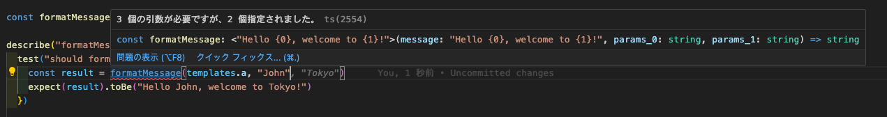

### テンプレート文字列を生成するファクトリー関数を持つ

オブジェクト形式の templates から、下記`generate-types`を用いて型情報を生成する。

[generate-types](https://github.com/blackraccoon000/generate-types)

#### 使用例

```
const formatMessage = createMessageFormatter<MessageFormatType>()
const result = formatMessage(templates.a, "John", "Tokyo")
```

#### エラー例



#### サンプル

[nextjs14_blog](https://github.com/blackraccoon000/nextjs14_blog)

#### memo

build `npm run build`

npm 公開 `npm publish --access=public`

[@yfnote/create-message-formatter](https://www.npmjs.com/package/@yfnote/create-message-formatter)
